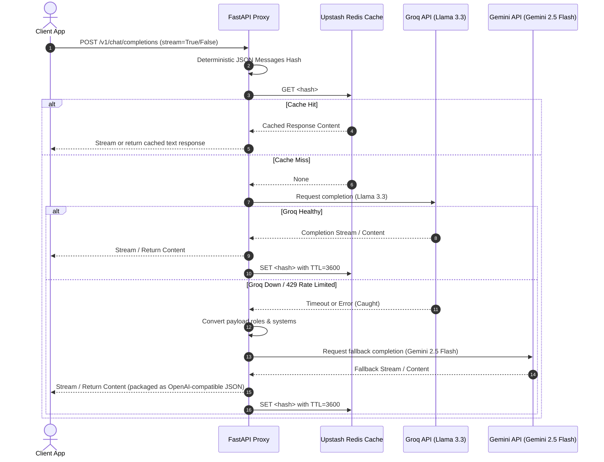

# Architectural Walkthrough of Fallback Middleware & Proxy Mechanics
This document details the mechanics and flow of the failover middleware and caching layers within the `main.py` proxy.
## 1. Request Flow Overview
The cost-and-latency guardrail proxy works on a straightforward "Check Cache -> Try Primary (Groq) -> Failover to Backup (Gemini) -> Cache Output" flow.

## 2. Core Mechanics Breakdown
### 2.1 Deterministic Caching Hook
To avoid caching identical requests differently based on key order within dictionaries, the incoming `messages` array is hashed using:
```python
def get_messages_hash(messages: List[Dict[str, Any]]) -> str:
    serialized = json.dumps(messages, sort_keys=True)
    return hashlib.sha256(serialized.encode("utf-8")).hexdigest()
```
* Using `sort_keys=True` ensures that any variation in client-side key serialization (e.g., `{"role": "user", "content": "hi"}` vs `{"content": "hi", "role": "user"}`) evaluates to the exact same hash value.
* We read and write this hash from/to Upstash Redis asynchronously using the `upstash-redis` client, keeping proxy execution non-blocking.
### 2.2 Streaming Failover Connection Testing
Handling failover within streams is notoriously difficult because standard StreamingResponses begin transferring headers and initial data bytes immediately. Once a stream starts sending a HTTP 200 to the client, you cannot seamlessly fall back to another upstream service.
To solve this, the proxy uses **Connection Testing**:
```python
# Try Groq and read the very first chunk to verify availability
groq_stream = await groq_client.chat.completions.create(**groq_kwargs)
first_chunk = await groq_stream.__anext__()
```
* We call `__anext__()` on the async iterator returned by Groq.
* If Groq is experiencing downtime (503), rate limits (429), or connection timeout, the call immediately throws an exception *before* any bytes are flushed to the client.
* This exception is caught, and we route the payload to Gemini. We only yield chunks to the client after a provider successfully begins generating text.
### 2.3 Payload Mapping (OpenAI to Gemini)
Because the fallback to Gemini uses the official `google-genai` SDK, the request payload must be mapped from OpenAI's structure to Gemini's expected format:
1. **System Instruction Extraction**: System roles in OpenAI are popped out of the messages list and placed into Gemini's `GenerateContentConfig(system_instruction=...)`.
2. **Role Conversion**: Roles like `assistant` are mapped to Gemini's expected `model` role.
3. **Structured Types**: Messages are parsed into lists of `types.Content` containing `types.Part` instances using the factory helper `types.Part.from_text(text=content)`.
---
## 3. Deployment and Environment Variables
The proxy is configured to use the following environment variables:
* `GROQ_API_KEY`: API Key for Groq Cloud.
* `GEMINI_API_KEY`: API Key for Google AI Studio.
* `UPSTASH_REDIS_REST_URL`: Upstash Redis HTTP url (e.g. `https://upstash.com/`).
* `UPSTASH_REDIS_REST_TOKEN`: Upstash Redis token.
* `DEFAULT_GROQ_MODEL`: Defaults to `llama-3.3-70b-versatile` (configurable).
* `FALLBACK_GEMINI_MODEL`: Defaults to `gemini-2.5-flash` (configurable).
